  

 

 

  

  

 

<table>
  <tr>
    <td align="center" width="25%"><b>LANGUAGES</b>  </td>
    <td align="center" width="25%"><b>FRONTEND</b>  </td>
    <td align="center" width="25%"><b>BACKEND & DATA</b>  </td>
    <td align="center" width="25%"><b>INFRA</b>  </td>
  </tr>
</table>

 

| | Repository | What it is | Stars |
|:---:|:---|:---|:---:|
| 🎵 | **[MusicBot](https://github.com/umutxyp/MusicBot)** | Discord.js v14 music bot — YouTube, Spotify, SoundCloud & direct links |  |
| 🔍 | **[Seo-Promt-Master](https://github.com/umutxyp/Seo-Promt-Master)** | Google's full SEO docs as an AI prompt machine — audit every route, fix the gaps |  |
| 🌐 | **[Discord-Bot-Website](https://github.com/umutxyp/Discord-Bot-Website)** | React + Tailwind website theme for Discord bots |  |
| 🧑‍💻 | **[Personal-Website](https://github.com/umutxyp/Personal-Website)** | Clean, customizable Next.js developer portfolio |  |
| ⚡ | **[slash-command-bot](https://github.com/umutxyp/slash-command-bot)** | discord.js v14 slash-command handler boilerplate |  |
| 🛡️ | **[Shroudly](https://github.com/umutxyp/Shroudly)** | DPI bypass app for Windows — break through censorship |  |
| 🤖 | **[discordJS-V14](https://github.com/umutxyp/discordJS-V14)** | Slash + prefix command handler starter |  |
| 📦 | **[@justdiscord/sdk](https://github.com/justdiscordorg/sdk)** | Official JustDiscord API client — votes, stats, webhook verification. Zero deps, ESM + CJS |  |
| 🟩 | **[MCStat-Plugin](https://github.com/mcstatorg/MCStat-Plugin)** | Bukkit/proxy plugin — signed telemetry, sessions, TPS, vote links |  |

 

 

