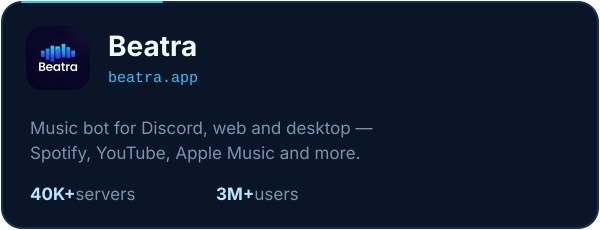
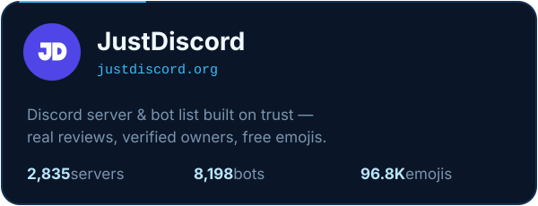
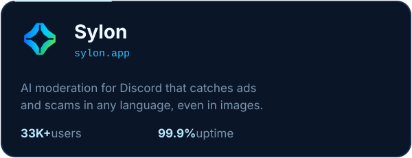

  

 

### 👋 About

I'm **Umut**, a full-stack developer from Turkey. I build and run high-traffic web platforms and Discord products used by millions of people — from the database to the UI. Also into AI systems, SEO at scale and self-hosted infrastructure.

 

### 🚀 Projects

 

### ⚙️ Tech Stack

 

### 📦 Open Source

| Repository | Description |
|:---|:---|
| [MusicBot](https://github.com/umutxyp/MusicBot) | Discord.js v14 music bot — YouTube, Spotify, SoundCloud |
| [Seo-Promt-Master](https://github.com/umutxyp/Seo-Promt-Master) | Google's SEO docs as an AI prompt — audit and fix every page |
| [Discord-Bot-Website](https://github.com/umutxyp/Discord-Bot-Website) | React + Tailwind website theme for Discord bots |
| [Personal-Website](https://github.com/umutxyp/Personal-Website) | Clean Next.js developer portfolio |
| [Shroudly](https://github.com/umutxyp/Shroudly) | DPI bypass app for Windows |
| [slash-command-bot](https://github.com/umutxyp/slash-command-bot) | discord.js v14 slash-command boilerplate |

 

### 📈 Activity

